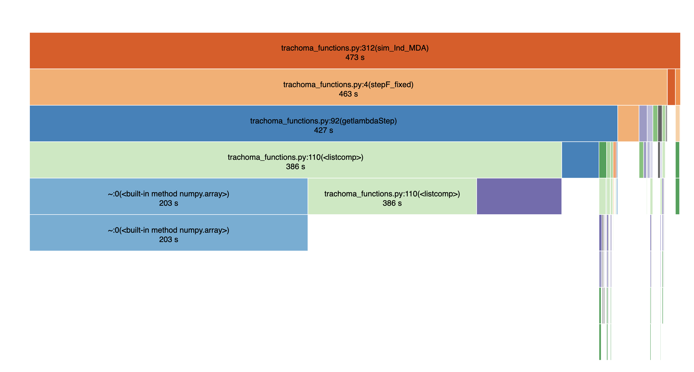

# Reviewing the Trachoma model

#### Reviewers: Thibault Lestang and Ben Lambert (OxRSE members)

#### Date: 28th July 2021

## Introduction

The OxRSE team were tasked with reviewing the `Trachoma_Simulation()` function at https://github.com/ArtRabbitStudio/ntd-model-trachoma with an aim to improving the efficiency of it. The review that we conducted encompassed the following elements:

1. profiling the code to identify bottlenecks

2. suggesting improvements to individual units of code and benchmarking these pieces versus the existing versions

3. integrating these changes into the model and benchmarking the whole 

Note that, in 3., we have not extensively tested our modifications and suggest this be done before integrating our changes.


# Code profiling

We first profiled the `Trachoma_Simulation` function. On initial running of the function, it was clear that it was running in parallel. Since parallelisation can make it harder to understand code profiling results, we changed the line:

`num_cores = multiprocessing.cpu_count()`

to:

`num_cores = 1`

in the `trachoma_simulations.py` file.

We then analysed the following code snippet (`test_run.py`; extracted from the `trachoma_tests.ipynb` notebook):

```python
from trachoma.trachoma_simulations import Trachoma_Simulation


BetFilePath = 'files/InputBet_scen1.csv'
MDAFilePath = 'files/InputMDA_scen1.csv'
PrevFilePath = 'files/OutputPrev_scena1.csv'
InfectFilePath = 'files/Infect.csv'

Trachoma_Simulation(BetFilePath=BetFilePath,
                    MDAFilePath=MDAFilePath,
                    PrevFilePath=PrevFilePath,
                    SaveOutput=False,
                    OutSimFilePath=None,
                    InSimFilePath=None,
                    InfectFilePath=InfectFilePath)
```

To profile the code, we used `cProfile` and [snakeviz](https://jiffyclub.github.io/snakeviz/), running the following bash command:

`python3 -m cProfile -o temp.dat test_run.py`

The resultant code took ~475s to run. The runtime was dominated by time spent in `trachoma_functions` (~473s) and we present the profiling of this below.



This indicates that the bulk of time is spent in the `stepF_fixed` function (~463s), and, within this, the majority of time was spent in `getlambdaStep` (~427s). Interestingly, within the latter function, over 90% of runtime was spent on a single line (line 110 of `trachoma_functions`):

`positions = [bisect.bisect(x=Age[i], a=np.array([0, 9 * 52, 15 * 52, demog['max_age'] * 52])) - 1 for i in range(len(Age))]`

When we examine the profiling a little further, we find that this line was called 243,900 times throughout the simulation.

Our first question was, what does this line do? To answer this, we unwrapped the list comprehension into a standard for loop:

```python
positions = []
for i in range(len(Age)):
    a=np.array([0, 9 * 52, 15 * 52, demog['max_age'] * 52])
    idx = bisect.bisect(x=Age[i], a=a) - 1
    positions.append(idx)
```

The above creates a new list `positions` which is a mapping to `Age`. Elements of `positions` are `0`, `1` or `2` depending on whether the corresponding `Age` value is within a given age group (0-9yo, 9-15yo, above 15yo).

(Apart from speed considerations, one thing worth noting here is that `demog['max_age']=3120`. Taking $3120 / 52=60$, we obtain (presumably) 60 years. Thus it appears that multiplying by 52 *could* be a code bug.)  

Further profiling showed that creating the np array is costly, followed by the call to `bisect`.

## Code improvements

In order to suggest speed-ups, we sought to understand what `bisect` did. Reading its documentation, it is clear that it takes as argument a number being queried and it then determines the "bin" which that value sits. So here, an alternative way to write the same function is:

```python
positions = []
for i in range(len(Age)):
    if age > 15:
        idx = 2
    if age > 9:
        idx = 1
    else:
        idx = 0
    positions.append(idx)
```

To avoid list appending, we instead abstracted the above logic into a function and used `map` to iterate across the `Age` vector:

```python
def assign_age_group(age):
    if age > 15:
        return 2
    if age > 9:
        return 1
    return 0

positions = map(assign_age_group, Age)
```

We then benchmarked the new code versus the original using the following script:

```python
import numpy as np
import bisect
import timeit


def orig(Age):
    max_age = 60
    positions = []
    for i in range(len(Age)):
        a = np.array([0, 9, 15, max_age])
        idx = bisect.bisect(x=Age[i], a=a) - 1
        positions.append(idx)
    return positions


def assign_age_group(age):
    if age > 15:
        return 2
    if age > 9:
        return 1
    return 0


Age = np.random.randint(0, 60, 10)
nreps = 10000
time_map = timeit.timeit(
    "positions = map(assign_age_group, Age)",
    number=nreps,
    setup="from __main__ import assign_age_group, Age",
)
print(f"[map]: {nreps} done in {time_map*0.001}s")
time_orig = timeit.timeit(
    "positions = orig(Age)", number=nreps, setup="from __main__ import orig, Age"
)
print(f"[orig]: {nreps} done in {time_orig*0.001}s")
```

This resulted in the following output:

```
[map]: 10000 done in 1.3694230001419784e-06s
[orig]: 10000 done in 0.0001358610779971059s
```

indicating that the new code was ~100X faster.

## Benchmarking

After integrating the above modifications into the `getlambdaStep` function, we ran 20 replicates of both the original and `map` version of the code. Since the original `Trachoma_Simulation` code ran in about 8 minutes, we reduced the runtime by modifying the parameter file.